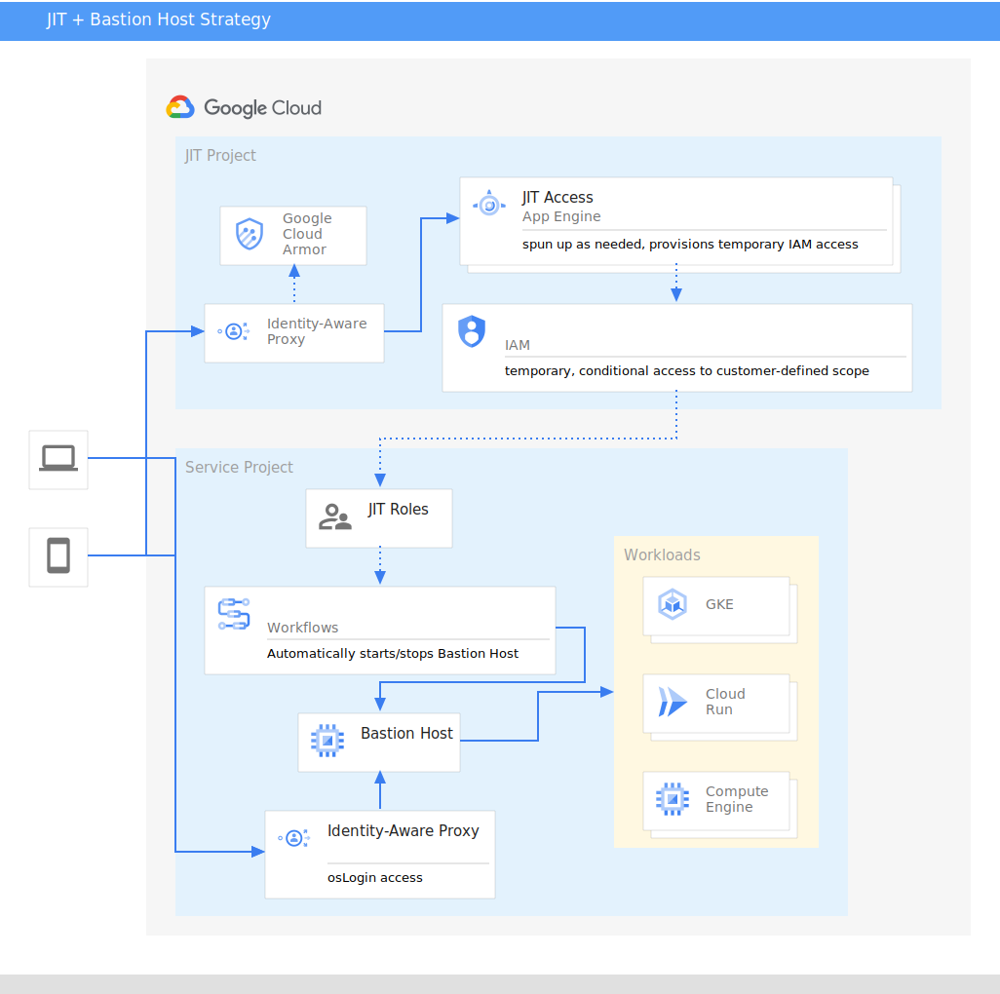

<!-- Copyright 2023 Google LLC

Licensed under the Apache License, Version 2.0 (the "License");
you may not use this file except in compliance with the License.
You may obtain a copy of the License at

    https://www.apache.org/licenses/LICENSE-2.0

Unless required by applicable law or agreed to in writing, software
distributed under the License is distributed on an "AS IS" BASIS,
WITHOUT WARRANTIES OR CONDITIONS OF ANY KIND, either express or implied.
See the License for the specific language governing permissions and
limitations under the License. -->

<!-- BEGIN_TF_DOCS -->
# Just-in-time Access requests (+ Bastion Host for log/kubectl/gcloud/curl/etc access)

GCP Customers can enable teams with a Just-in-Time approval mechanism to projects in their cloud organizations.

Features:

1. manage which users can request which project IAM role bindings ahead of support / break glass events
2. allow deployment of pre-baked bastion host images specific to your project needs and configure the networking / firewall security settings ahead of time
3. automatically provision/destroy the bastion host in accordance with the configured timeouts
4. all elevated access requests and activities are logged, audited, and associated directly with the user performing these actions
5. gracefully support IAM access solutions from Terraform, GCDS, or other Google Groups management workflows
6. support self-approved access requests or multi-party approvals via the [JIT access tool](https://github.com/GoogleCloudPlatform/jit-access)

## High Level Architecture Overview for JIT+Bastion Host

In this diagram, an example project is drawn out with supporting architecture to highlight the proposed configuration.

## Getting Started

1. Create users, add `has({}.jitAccessConstraint)` conditional IAM to project role bindings for users to be eligible (or the multiparty constraint, per docs)

   Follow the instructions at [JIT access tool](https://github.com/GoogleCloudPlatform/jit-access) to make roles requestable by a user.

   You can choose your mechanism to administer users (Google and Workspace terraform providers, API, Google Consoles, GCDS, etc).

2. Apply the terraform here after filling out the tfvars
3. Grant access to allow the application to resolve group memberships

   The "Groups Reader" role for the service account must be applied in the Google Admin console, which could be done with the Google Workspace provider.

   The Just-In-Time Access application lets you grant eligible access to a specific user or to an entire group. To evaluate group memberships, the application must be allowed to read group membership information from your Cloud Identity or Google Workspace account.

   To grant the application's service account access permission to read group memberships, do the following:

   1. Open the [Google Admin console](https://admin.google.com/) and sign in as a super-admin user.
   2. Go to Account > Admin Roles > Groups Reader > Admins > Assign service accounts and enter `jitaccess@$PROJECT_ID.iam.gserviceaccount.com` where $PROJECT\_ID is the ID emitted from `tf apply`. Click "Add" and "Asign role".

## Requirements

No requirements.

## Providers

| Name                                                          | Version |
| ------------------------------------------------------------- | ------- |
|  [archive](#provider\_archive) | n/a     |
|  [google](#provider\_google)    | n/a     |
|  [null](#provider\_null)          | n/a     |
|  [random](#provider\_random)    | n/a     |

## Modules

| Name                                                                  | Source                                                                          | Version |
| --------------------------------------------------------------------- | ------------------------------------------------------------------------------- | ------- |
|  [jit-project](#module\_jit-project) | https://github.com/GoogleCloudPlatform/cloud-foundation-fabric//modules/project | n/a     |

## Resources

| Name                                                                                                                                                            | Type        |
| --------------------------------------------------------------------------------------------------------------------------------------------------------------- | ----------- |
| [google_app_engine_application.jit_gae_app](https://registry.terraform.io/providers/hashicorp/google/latest/docs/resources/app_engine_application)              | resource    |
| [google_app_engine_standard_app_version.jit_v1](https://registry.terraform.io/providers/hashicorp/google/latest/docs/resources/app_engine_standard_app_version) | resource    |
| [google_iap_brand.jit_brand](https://registry.terraform.io/providers/hashicorp/google/latest/docs/resources/iap_brand)                                          | resource    |
| [google_iap_client.jit_iap_client](https://registry.terraform.io/providers/hashicorp/google/latest/docs/resources/iap_client)                                   | resource    |
| [google_organization_iam_member.jit_sa_iam](https://registry.terraform.io/providers/hashicorp/google/latest/docs/resources/organization_iam_member)             | resource    |
| [google_project_iam_binding.bastion_iap_frontend_access](https://registry.terraform.io/providers/hashicorp/google/latest/docs/resources/project_iam_binding)    | resource    |
| [google_project_iam_member.jit_debugger](https://registry.terraform.io/providers/hashicorp/google/latest/docs/resources/project_iam_member)                     | resource    |
| [google_project_iam_member.jit_gae_api_iam](https://registry.terraform.io/providers/hashicorp/google/latest/docs/resources/project_iam_member)                  | resource    |
| [google_storage_bucket_object.app-engine-source-zip-obj](https://registry.terraform.io/providers/hashicorp/google/latest/docs/resources/storage_bucket_object)  | resource    |
| [null_resource.prepare_jit_code](https://registry.terraform.io/providers/hashicorp/null/latest/docs/resources/resource)                                         | resource    |
| [random_string.suffix](https://registry.terraform.io/providers/hashicorp/random/latest/docs/resources/string)                                                   | resource    |
| [archive_file.app-engine-source-zip](https://registry.terraform.io/providers/hashicorp/archive/latest/docs/data-sources/file)                                   | data source |

## Inputs

| Name                                                                                                                                              | Description                                                                                                      | Type          | Default           | Required |
| ------------------------------------------------------------------------------------------------------------------------------------------------- | ---------------------------------------------------------------------------------------------------------------- | ------------- | ----------------- | :------: |
|  [billing\_account\_id](#input\_billing\_account\_id)                                                      | n/a                                                                                                              | `string`      | `null`            |    no    |
|  [jit\_elevate\_duration](#input\_jit\_elevate\_duration)                                                | n/a                                                                                                              | `number`      | `120`             |    no    |
|  [jit\_project\_id](#input\_jit\_project\_id)                                                                  | n/a                                                                                                              | `string`      | `null`            |    no    |
|  [jit\_region](#input\_jit\_region)                                                                                | n/a                                                                                                              | `string`      | `"us-central1"`   |    no    |
|  [jit\_service\_account](#input\_jit\_service\_account)                                                   | n/a                                                                                                              | `string`      | `null`            |    no    |
|  [jit\_support\_email](#input\_jit\_support\_email)                                                         | n/a                                                                                                              | `string`      | n/a               |   yes    |
|  [jit\_zone](#input\_jit\_zone)                                                                                      | n/a                                                                                                              | `string`      | `"us-central1-a"` |    no    |
|  [org\_id](#input\_org\_id)                                                                                            | n/a                                                                                                              | `string`      | n/a               |   yes    |
|  [org\_wide\_list\_of\_jit\_users\_groups](#input\_org\_wide\_list\_of\_jit\_users\_groups) | i.e. user:abc@example.com, serviceAccount:...-compute@developer.gserviceaccount.com, group:jit-users@example.com | `set(string)` | n/a               |   yes    |

## Outputs

| Name                                                                               | Description |
| ---------------------------------------------------------------------------------- | ----------- |
|  [app\_engine\_url](#output\_app\_engine\_url) | n/a         |
<!-- END_TF_DOCS -->